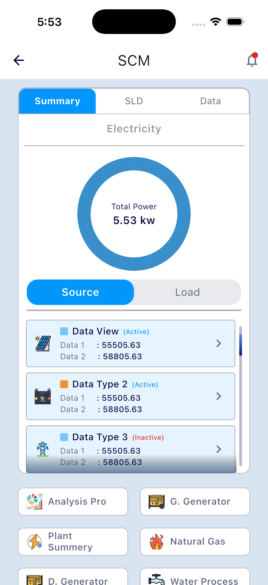
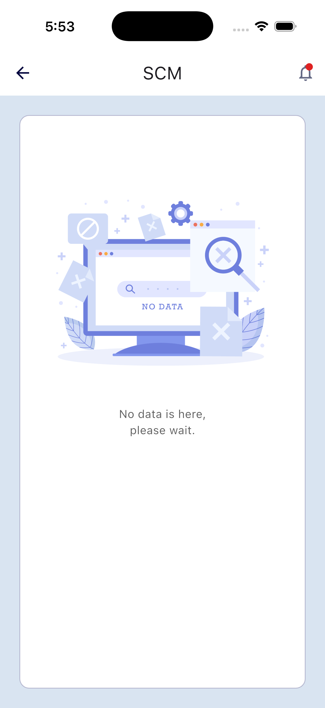
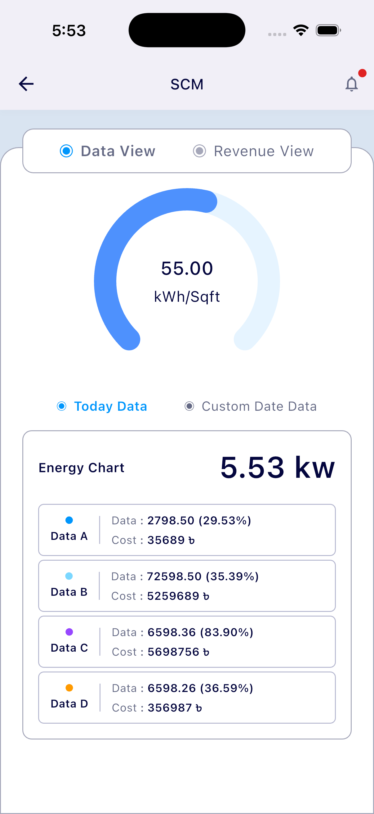
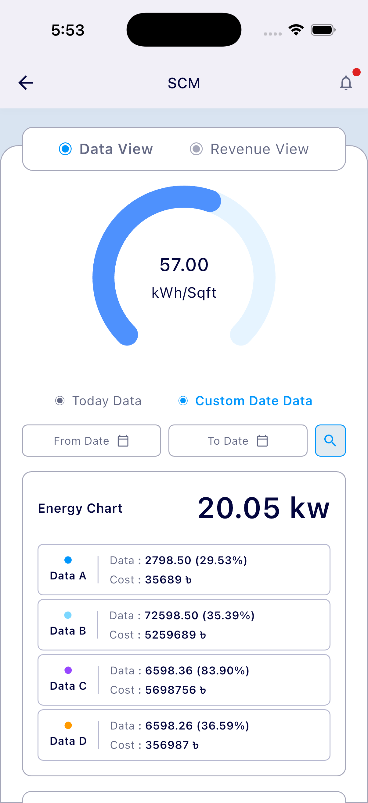
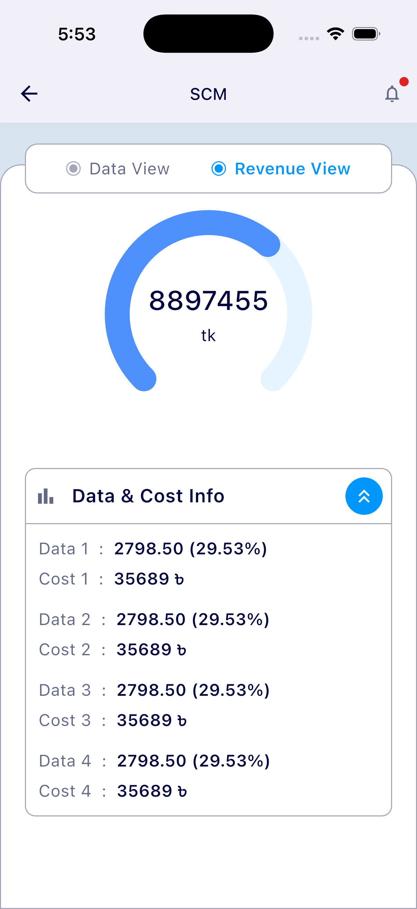
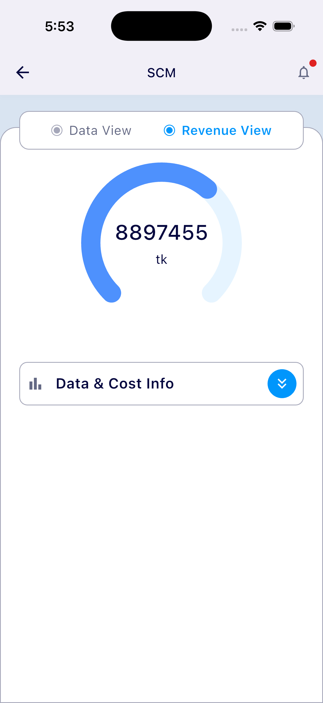

# Scube Task App – Flutter

A Flutter mobile application developed as part of the **Flutter Developer recruitment task for Scube Technologies Ltd**.  
The app UI and flow are implemented by strictly following the provided **Figma design and prototype**.

---

## 📱 App Overview

This project demonstrates:
- Pixel-perfect UI implementation from Figma
- Clean and structured Flutter code
- Responsive layout for different screen sizes
- Proper widget composition and state handling

---

## 🎨 Design Reference

- **Figma Design (Raw File):**  
  https://www.figma.com/design/LvDowOoeMXkUbbuJa6bGha/Scube-Task-App

- **Figma Prototype:**  
  https://www.figma.com/proto/LvDowOoeMXkUbbuJa6bGha/Scube-Task-App

---

## 🧩 Features Implemented

- ✔ Exact UI based on Figma design
- ✔ Smooth navigation according to prototype flow
- ✔ Responsive UI using `MediaQuery` / layout widgets
- ✔ Clean folder structure
- ✔ Reusable widgets
- ✔ Material design principles

---

## 📸 Screenshots

<p align="center">
  
  
  
  
  
  
</p>


---

## 🛠 Tech Stack

- **Flutter**
- **Dart**
- **Material UI**

---

## 📂 Project Structure

```text
lib/
├── main.dart
├── controllers/
│   ├── login_controller.dart
│   ├── dashboard_controller.dart
│   └── energy_dashboard_controller.dart
├── screens/
│   ├── login_screen.dart
│   ├── dashboard_screen.dart
│   ├── energy_data_screen.dart
│   └── empty_screen.dart
├── widgets/
│   ├── custom_text_field.dart
│   ├── dashboard_widgets.dart
│   └── energy_data_widgets.dart
└── model/
    └── data_model.dart
